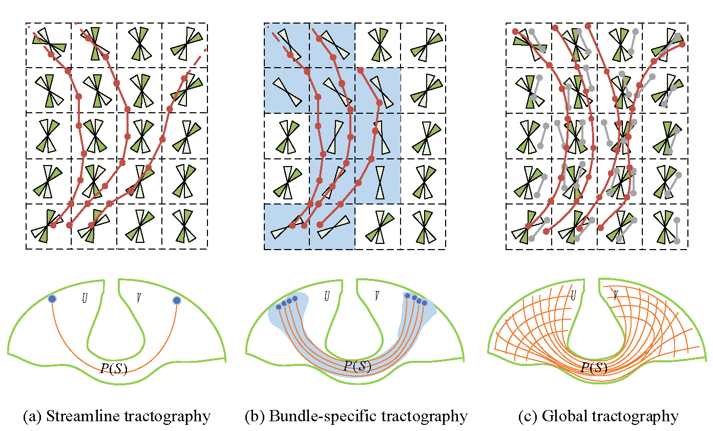
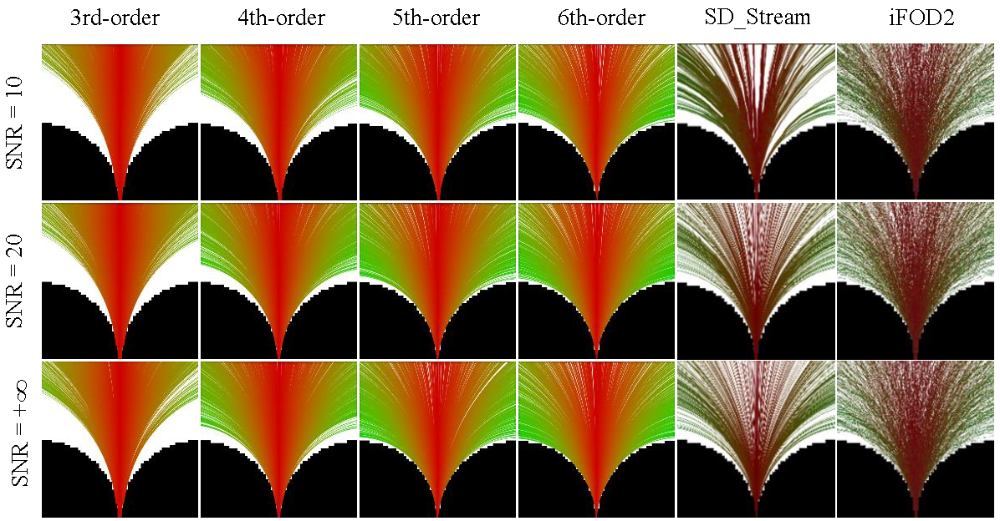
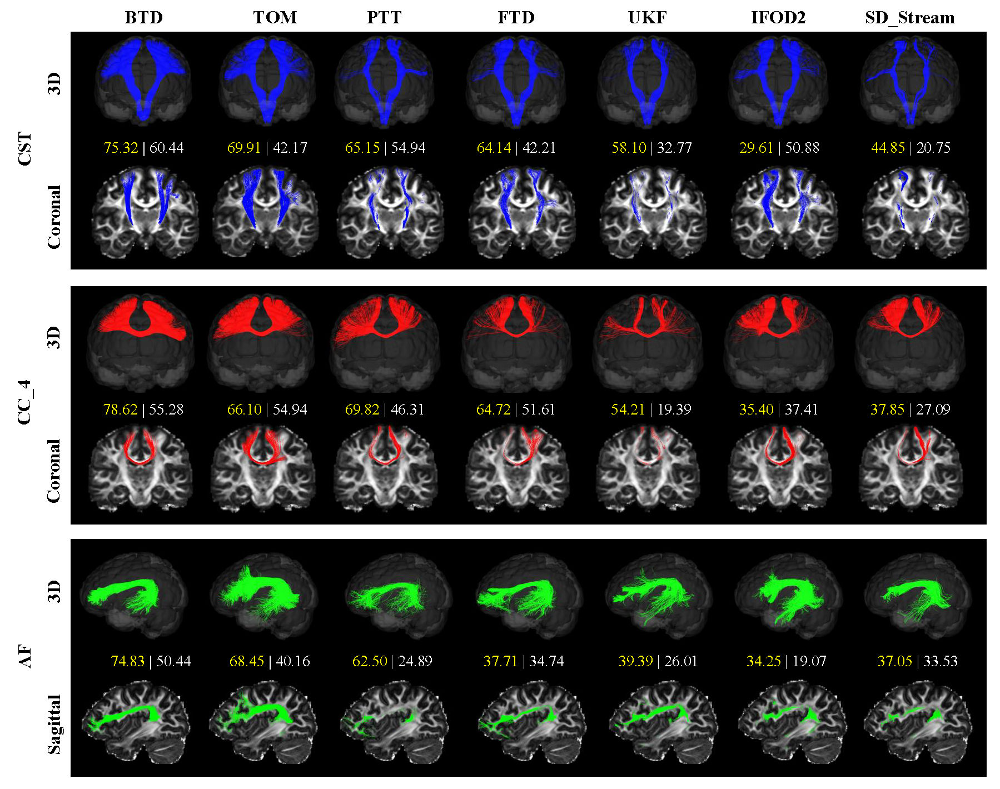

# README

# **Bundle-specific tractogram distribution estimation using higher-order streamline differential equation ** 

Preliminary version submitted to NeuroImage
#*Schematic representation of different tractography methods*

# usage
The folder 'simulate' is code of simulate data, and the folder 'vivo' is code of vivo data.
Run BTD_Tractography.m

# Result
#*the tractography results on Hough data*

#*the tractography results on #100307 HCP dataset*

# Concact

---

Lei Xie, leix@zjut.edu.cn# BTD

